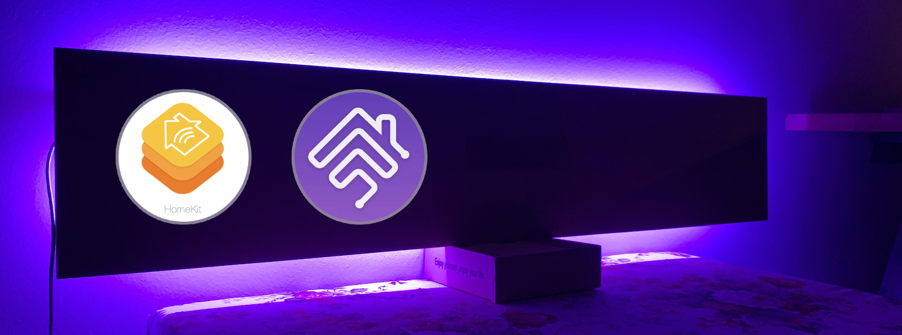

# Smart Lamp with HomeKit integration. All written in Swift.



This project contains three parts:
1. LED Control client for iOS
2. LED Server running on Raspberry Pi
3. Homebridge config

## Install Raspbian

On the Raspberry PI you must run [Raspbian](https://www.raspbian.org) and connecting to your local network.

## Install Swift
First step is to install Swift by adding the swift-arm repo:

```shell
curl -s "https://packagecloud.io/install/repositories/swift-arm/release/script.deb.sh>""| sudo bash
```

Followed by installing Swift itself.

```shell
sudo apt-get install swift5
```

## Install Homebridge

For that just follow the official installation [guide](https://github.com/nfarina/homebridge/wiki/Running-HomeBridge-on-a-Raspberry-Pi) for Raspberry Pis.

You have to add a new accessory. Therefore, cop that part from the `homebridge-config` of this repo.

## Run the Server

- clone this repo to your Raspberry Pi
- go into the `LED-Server` sub-folder
- build the swift project: `swift build`
- now the binary has been created
- I recommend to create a linux service and run the binary on startup.

## Connecting hardware

I bought a cheap [WS2812B](https://www.aliexpress.com/item/32849686500.html?spm=a2g0s.9042311.0.0.36094c4dQgI6al) LED strip on Aliexpress. It has three connectors.
- Connect the data pin of your LED strip to `GPIO18`. This is needed because this is the pin which supports PWM.
- The ground connector must be connected to any of the ground pins of the Raspberry Pi.
- The third connector of the LED strip is for power supply. Connect it to one of the 5V pins of your Raspberry PI.

## Control your light

Afterwards you should be able to control your lamp either via Homekit, including Siri and from the small iOS application `Raspberry PI LED Controller` which is also part of this repo.

<p align="center">
  
</p>

## Remarks
I am using a Raspberry Pi Zero. If you are using a different model, you need to change the `LED.swift` file accordingly in the 'LED Server' part of the repo.
